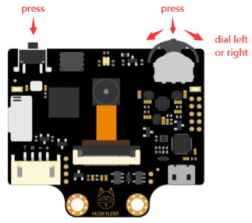

# 사용자 추적 기반 지향성 음향 시스템

## 초음파 파라메트릭 스피커와 AI 객체 추적을 활용한 1:1 개인화 청각환경 구현

---

## 프로젝트 개요

기존 스피커는 소리를 사방으로 확산시키는 구조로 설계되어 있어  
특정 사용자에게만 음성을 전달하기 어렵고 주변에 불필요한 소음이 발생하는 문제가 있습니다.

본 프로젝트는 **초음파 기반 지향성 음향 기술(Parametric Speaker)** 과  
**AI 기반 객체 추적 시스템(HuskyLens)**,  
그리고 **2축 병렬 PID 제어 알고리즘**을 결합하여

> 특정 사용자에게만 소리를 전달하고  
> 사용자의 움직임을 실시간으로 추적하며  
> 스피커 방향을 자동으로 제어하는  
> 1:1 개인화 청각 환경 시스템을 구현하는 것을 목표로 합니다.

---

## 주요 기능

- 40kHz 초음파 기반 지향성 음향 송출
- HuskyLens 기반 실시간 얼굴 추적
- X/Y 2축 서보모터 제어
- 병렬 PID 제어 구조 적용
- Deadband 기반 진동 억제
- 거리 기반 Gain Scheduling
- Lost Mode 상태 머신 설계

---

## 시스템 구성

### 전체 신호 흐름

HuskyLens (AI Tracking)  
↓ I2C  
MCU (PID Controller)  
↓ PWM  
Dual Servo Motor (X/Y)  
↓  
Parametric Speaker (40kHz Array)

---

### 동작 설명

- 카메라 모듈(HuskyLens)이 사용자 위치를 실시간 추적
- MCU에서 위치 오차 계산 및 PID 제어 수행
- 서보모터를 통해 스피커 방향 자동 조정
- 초음파 자가복조(Self-Demodulation)를 통해 가청음 생성

---

## HuskyLens 좌표계


- 해상도: 320 × 240
- 중심 좌표: (160, 120)
- PID 제어는 중심 좌표와 측정 좌표의 오차를 기반으로 동작

---

## HuskyLens 모듈



- CNN 기반 객체 인식
- I2C 통신으로 MCU에 좌표 데이터 전송
- 실시간 Tracking 모드 사용

---

## 제어 흐름도 (Control Flow Diagram)


### 상태 머신 동작 과정

1. Controller Power ON
2. Microprocessor 초기화
3. 서보모터 Center 초기화
4. 객체 인식 여부 판단
   - Yes → Tracking Mode
   - No → Lost Mode
5. Tracking Mode
   - PID 제어
   - PWM 출력
   - 서보 구동
   - 루프 반복
6. Lost Mode
   - 일정 시간 위치 유지
   - 임계 시간 초과 시 안전 복귀

---

## 2축 PID 제어 블록도


### 제어 수식

오차 계산:

error = reference - measurement

PID 제어식:

u(t) = Kp·e(t) + Ki∫e(t)dt + Kd·de(t)/dt

출력:

- 출력 제한 로직 (Limiter)
- PWM 변환
- 서보모터 각도 제어 (θx, θy)

폐루프(Closed-loop) 구조로 실시간 피드백 제어 수행

---

## 초음파 구동 회로


- 40kHz 캐리어 생성
- 오실레이터 및 필터 회로
- 초음파 트랜스듀서 배열 구동

---

## 최종 프로토타입


- 40kHz 초음파 트랜스듀서 × 50
- HuskyLens 카메라 모듈
- 2축 서보모터 구조
- 초음파 구동 보드 내장

---

## 저장소 구조 (Repository Structure)

```plaintext
PERSONAL-DIRECTIONAL-SPEAKER/
├── README.md
├── code/
│   ├── x_axis_tracking
│   └── xy_axis_pid_tracking
├── docs/
│   ├── Poster.png
│   └── Capstone_Report.txt
├── hardware/
│   ├── control_flow_diagram.png
│   ├── huskylens_coordinate_system.png
│   ├── huskylens_module_overview.png
│   ├── pid_block_diagram.png
│   ├── prototype_system.jpg
│   └── ultrasonic_driver_circuit.png
└── media/
```

---

## 시연 영상

(여기에 유튜브 링크 추가)

---

## 기대 효과 및 활용 분야

- 공공장소 소음 최소화
- 박물관/전시장 맞춤형 음성 안내
- 병원·복지시설 개인 알림 시스템
- 스마트홈 개인 음성 전달
- 접근성 보조 시스템 확장 가능

---

## 향후 개선 방향

- 밀폐 공간 내 반사 문제 개선
- 흡음재 및 차폐 구조 설계
- 제어 정밀도 향상
- 초음파 배열 최적화

---

## 프로젝트 정보

인천대학교 전기공학과  
2025-2학기 캡스톤 디자인

팀장: 이기현
