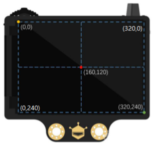
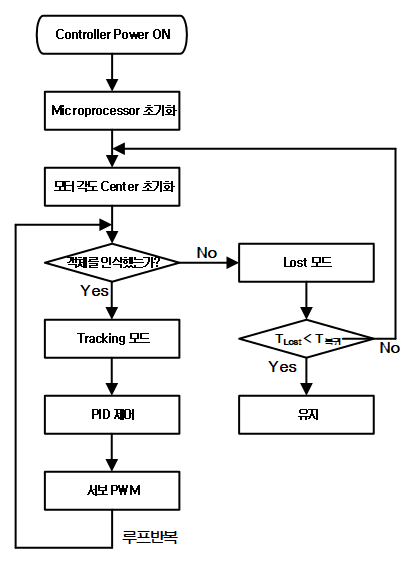
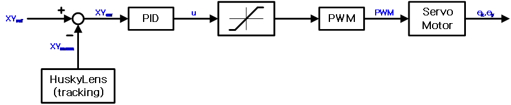
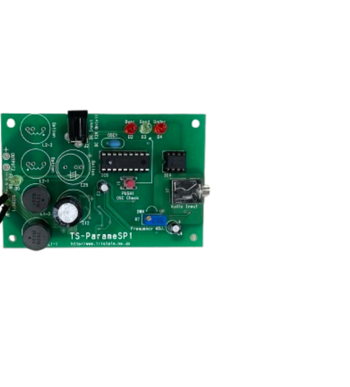
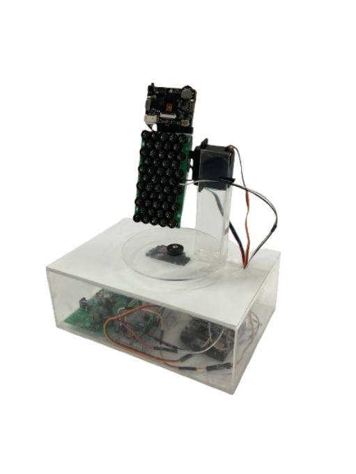

# 사용자 추적 기반 지향성 음향 시스템

초음파 파라메트릭 스피커와 얼굴 추적 기술을 결합한 사용자 추적형 음향 시스템입니다. HuskyLens가 사용자의 위치를 인식하면 MCU가 X/Y축 위치 오차를 계산하고, 두 개의 서보모터로 스피커의 방향을 조절합니다.

## 프로젝트 개요

일반적인 스피커는 소리를 넓은 범위로 확산하기 때문에 특정 방향으로 음향을 전달하기 어렵습니다. 이 프로젝트는 초음파 기반 지향성 음향과 사용자 추적 제어의 결합 가능성을 확인하는 것을 목표로 합니다.

- 40 kHz 초음파 트랜스듀서 배열을 이용한 지향성 음향 송출
- HuskyLens의 얼굴 인식 및 좌표 추적
- X/Y축 독립 PID 제어를 이용한 스피커 방향 조절
- 추적 상태에 따른 제어 출력 보정 로직

## 시스템 구성

```text
HuskyLens
    │ I2C: 사용자 중심 좌표
    ▼
MCU
    │ PWM: X/Y축 제어 신호
    ▼
2축 서보모터
    │ 스피커 방향 조절
    ▼
40 kHz 파라메트릭 스피커
```

HuskyLens는 320 × 240 화면에서 사용자의 중심 좌표를 측정합니다. MCU는 화면 중심인 `(160, 120)`과 측정 좌표의 차이를 각 축의 제어 오차로 사용합니다.



## 동작 방식

1. 시스템을 초기화하고 서보모터를 기준 위치로 이동합니다.
2. HuskyLens가 학습된 얼굴을 감지해 중심 좌표를 MCU에 전달합니다.
3. MCU가 X축과 Y축의 위치 오차를 각각 계산합니다.
4. 각 축의 PID 제어 결과를 PWM 신호로 변환해 서보모터를 구동합니다.
5. 얼굴을 놓치면 마지막 위치를 잠시 유지한 뒤 기준 위치로 천천히 복귀합니다.



## 제어 알고리즘

각 축의 제어기는 다음 PID 식을 기준으로 동작합니다.

```text
e(t) = reference - measurement
u(t) = Kp·e(t) + Ki·∫e(t)dt + Kd·de(t)/dt
```

기본 PID 제어에 다음 보정 로직을 추가했습니다.

- **Deadband와 히스테리시스:** 중심 부근의 작은 오차를 제어 입력에서 제외합니다.
- **Gain scheduling:** 오차 크기에 따라 PID 게인과 축별 최대 이동량을 조절합니다.
- **출력 제한 및 anti-windup:** 서보모터의 동작 범위를 제한하고, 한계 위치에서는 직전 적분값으로 되돌립니다.
- **출력 평활화:** 제어 출력에 지수 이동 평균을 적용합니다.
- **Lost mode:** 일시적인 인식 실패에는 마지막 좌표를 사용하고, 장시간 대상을 찾지 못하면 중앙으로 복귀합니다.



## 지향성 음향

40 kHz 초음파 트랜스듀서 50개를 배열해 송출부를 구성했습니다. 변조된 초음파가 공기 중에서 전파될 때 발생하는 비선형 상호작용과 자기 복조(self-demodulation)를 이용하는 방식입니다.



## 프로토타입

프로토타입은 다음 부품으로 구성됩니다.

- 40 kHz 초음파 트랜스듀서 50개
- HuskyLens 카메라 모듈
- X/Y축 서보모터
- 초음파 신호 생성 및 구동 회로
- 제어용 MCU



## 소스 코드

- `code/x_axis_tracking/x_axis_tracking`: X축 단일 서보 추적 코드
- `code/xy_axis_pid_tracking/xy_axis_pid_tracking`: X/Y축 병렬 PID 추적 코드

코드는 Arduino 환경을 기준으로 작성했으며 `Wire`, `HUSKYLENS`, `Servo` 라이브러리를 사용합니다. 2축 코드의 기본 서보 핀은 X축 9번, Y축 10번입니다. 추적 전 HuskyLens에서 대상 얼굴을 ID 1로 학습하고 I2C 통신 모드로 설정해야 합니다.

## 저장소 구조

```text
.
├── code/       # Arduino 추적 제어 코드
├── docs/       # 프로젝트 보고서와 포스터
├── hardware/   # 시스템 구성도, 회로도, 프로토타입 사진
└── README.md
```

## 향후 개선 사항

- 밀폐 공간에서 발생하는 음향 반사 저감
- 흡음재 및 차폐 구조 최적화
- 추적 및 제어 정밀도 향상
- 초음파 트랜스듀서 배열 최적화

## 프로젝트 정보

- 소속: 인천대학교 전기공학과
- 과정: 2025학년도 2학기 캡스톤디자인
- 수상: 대상
